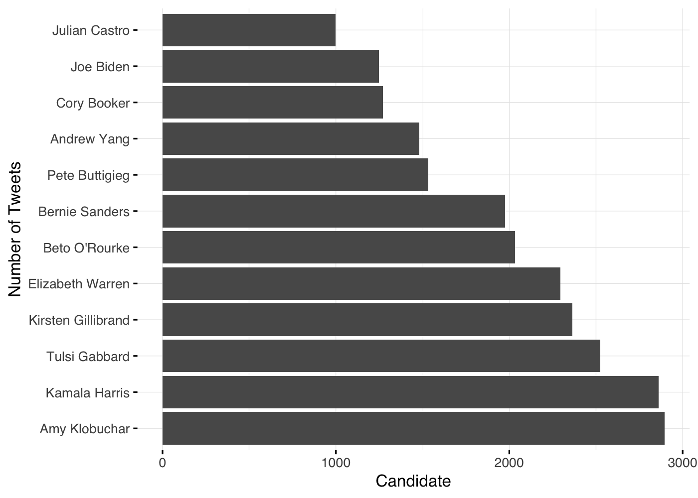

Following the Race: Using Sentiment Analysis to Explore the Twitter Feeds of Presidential Candidates
================
Connor Rothschild and Denizhan Yigitbas
5/16/2019

The R code for this post can be found [here](https://github.com/Denizhan-Yigitbas/Presidential-Candidate-Sentiment-Analysis/blob/master/markdown05_16.Rmd). A less technical version of this post without code snippets can be found [here](https://www.connorrothschild.com/single-post/2019/05/21/following-the-race).

Research Question and Goal
--------------------------

How do presidential candidates differ in their use of Twitter to publicize policy positions, garner support, and participate in the political arena? Are certain types of Tweets more effective at attracting support, as evidenced by a greater number of Tweet interactions?

One way to explore these questions is by using *sentiment analysis*, or the process of computationally categorizing opinions and emotionality in a piece of text. Some data scientists, for example, have used this technique to argue that Donald Trump's Twitter timeline is populated by [different Tweets from different people](http://varianceexplained.org/r/trump-tweets/).

Sentiment analysis has yet to be utilized to explore how *different* candidates use Twitter in different ways. By utilizing [sentence-level sentiment analysis](http://medium.com/@ODSC/an-introduction-to-sentence-level-sentiment-analysis-with-sentimentr-ac556bd7f75a) on individual Tweets as well as word-by-word analysis using the [NRC Word-Emotion Association Lexicon](http://saifmohammad.com/WebPages/NRC-Emotion-Lexicon.htm), we're able to explore these questions. The analysis leverages the power of the [sentimentr package](http://cran.r-project.org/web/packages/sentimentr/sentimentr.pdf) to better understand what types of emotions "sell" on Twitter and how candidates use the platform as a mechanism to attract political support.

Load Libraries
--------------

``` r
library(dplyr)
library(purrr)
library(twitteR)
library(tidyr)
library(lubridate)
library(scales)
library(tidyverse)
library(ggplot2)
library(tidytext)
library(readr)
library(sentimentr)
library(dplyr)
library(syuzhet)
library(broom)
library(cleanNLP)
library(textclean)
library(ggrepel)
library(tm)
library(stm)
library(quanteda)
library(knitr)
```

Data Collection
---------------

We begin our analysis with the data collection process. We use Python to gather a massive amount of Tweets (37,218!) from 12 presidential candidates' Twitter feeds. Specifically, we use two different methods for pulling Tweets. The main method involved using Twitter’s Tweepy Python library. We created an API that allowed us to pull various information about the most recent 3200 tweets by a user. [The API link could be found here](http://github.com/Denizhan-Yigitbas/Presidential-Candidate-Sentiment-Analysis/blob/master/DenizhanCode/TwitterUser.py).

In a later step, we will go further back in time to pull Tweets from 2016 presidential candidates for a comparative analysis. In order to do this, we use a [public GitHub repository](http://github.com/bpb27/twitter_scraping) that creates a scraper to pull candidate Tweets. The scraper automatically scrolls through the inputed date range on a given candidate's website and mines data while scrolling.

You can find further documentation of our data pulling process on [our Github](http://github.com/Denizhan-Yigitbas/Presidential-Candidate-Sentiment-Analysis).

Cleaning Data
-------------

The data we pull contains the information we need but is not quite ready for analysis.

``` r
uncleaned <- read_csv("customTwitterUsersCombinedUncleaned.csv")
kable(head(uncleaned$text))
```

<table>
<colgroup>
<col width="100%" />
</colgroup>
<thead>
<tr class="header">
<th align="left">x</th>
</tr>
</thead>
<tbody>
<tr class="odd">
<td align="left"><span class="citation">@samanthapetrick</span> Hey Rocco, happy 9th birthday! Sorry I missed the party. I hope you got some ice cream with that #Biden2020 cookie.</td>
</tr>
<tr class="even">
<td align="left">Congratulations to the Duke and Duchess of Sussex, Prince Harry and Meghan Markle, on the birth of their baby boy! The truth is there’s no better job than being a parent. Jill and I wish you the best of luck on your next chapter.</td>
</tr>
<tr class="odd">
<td align="left">On Saturday, Jill and I visited Columbia, South Carolina, to discuss how we’ll build an inclusive middle class where everyone — regardless of race, gender, sexual orientation, religion or disability — comes along. Thank you to everyone who joined us, we’ll be back soon! <a href="https://t.co/jly3piXzPE" class="uri">https://t.co/jly3piXzPE</a></td>
</tr>
<tr class="even">
<td align="left">Nevada, we’re taking our campaign to Henderson tomorrow, May 7th! Head to <a href="https://t.co/zTS0WldilG" class="uri">https://t.co/zTS0WldilG</a> to RSVP and come join us.</td>
</tr>
<tr class="odd">
<td align="left">On this first day of Ramadan, Jill and I wish peace and happiness to Muslims around the world celebrating the holy month. Ramadan Kareem.</td>
</tr>
<tr class="even">
<td align="left">Our country may seem more divided than ever, but I know our best days are still ahead. It’s time we lift our heads up and remember who we are. If you’re ready to get to work, join our campaign today. <a href="https://t.co/lyhRyWPhvS" class="uri">https://t.co/lyhRyWPhvS</a></td>
</tr>
</tbody>
</table>

Specifically, the presence of links and images may cause some problems as they are high in frequency but provide no insights into Tweet sentiment. Moreover, Tweets often include a large number of Twitter-specific characters such as @s and \#s.

We can clean this type of text using some RegEx and the [stringr package](http://cran.r-project.org/web/packages/stringr/stringr.pdf). Then, using the *tweetBinary* column in our dataset, we filter out Retweets (because we are interested in candidates' sentiment, not their followers').

``` r
cleaned <- uncleaned %>%
  filter(!str_detect(text, '^"')) %>%
  mutate(text = str_replace_all(text, "http://t.co/[A-Za-z\\d]+|&amp;", "")) %>% 
  mutate(text = str_replace_all(text, "@[A-Za-z0-9_]+[A-Za-z0-9-_]+", "")) %>% 
  mutate(text = str_replace_all(text, "@", "")) %>% 
  mutate(text = str_replace_all(text, "—", " ")) %>% 
  mutate(text = str_replace_all(text, "http\\S+", "")) %>%
  mutate(createdDate = parse_date_time(createdDate, 'mdy')) %>%  
  filter(!is.na(text)) %>% 
  filter(text!="")

cleaned$candidate <- recode(cleaned$candidate, "amyklobuchar"="Amy Klobuchar")
cleaned$candidate <- recode(cleaned$candidate, "ewarren"="Elizabeth Warren")
cleaned$candidate <- recode(cleaned$candidate, "BetoORourke"="Beto O'Rourke")
cleaned$candidate <- recode(cleaned$candidate, "JoeBiden"="Joe Biden")
cleaned$candidate <- recode(cleaned$candidate, "JulianCastro"="Julian Castro")
cleaned$candidate <- recode(cleaned$candidate, "TulsiGabbard"="Tulsi Gabbard")
cleaned$candidate <- recode(cleaned$candidate, "PeteButtigieg"="Pete Buttigieg")
cleaned$candidate <- recode(cleaned$candidate, "KamalaHarris"="Kamala Harris")
cleaned$candidate <- recode(cleaned$candidate, "BernieSanders"="Bernie Sanders")
cleaned$candidate <- recode(cleaned$candidate, "CoryBooker"="Cory Booker")
cleaned$candidate <- recode(cleaned$candidate, "AndrewYang"="Andrew Yang")
cleaned$candidate <- recode(cleaned$candidate, "SenGillibrand"="Kirsten Gillibrand")

cleanedtweets <- cleaned %>% 
  filter(tweetBinary == 1)

cleanedretweets <- cleaned %>% 
  filter(tweetBinary == 0)
```

This leaves us with 28,347 cleaned Tweets:

| candidate |           id| text                                                                                                                                                                                                                                                                       | createdDate |  favoriteCount|  retweetCount|  tweetBinary|
|:----------|------------:|:---------------------------------------------------------------------------------------------------------------------------------------------------------------------------------------------------------------------------------------------------------------------------|:------------|--------------:|-------------:|------------:|
| Joe Biden |  1.12554e+18| Hey Rocco, happy 9th birthday! Sorry I missed the party. I hope you got some ice cream with that \#Biden2020 cookie.                                                                                                                                                       | 2019-05-06  |             39|             5|            1|
| Joe Biden |  1.12553e+18| Congratulations to the Duke and Duchess of Sussex, Prince Harry and Meghan Markle, on the birth of their baby boy! The truth is there’s no better job than being a parent. Jill and I wish you the best of luck on your next chapter.                                      | 2019-05-06  |          13842|           948|            1|
| Joe Biden |  1.12552e+18| On Saturday, Jill and I visited Columbia, South Carolina, to discuss how we’ll build an inclusive middle class where everyone regardless of race, gender, sexual orientation, religion or disability comes along. Thank you to everyone who joined us, we’ll be back soon! | 2019-05-06  |           2783|           410|            1|
| Joe Biden |  1.12550e+18| Nevada, we’re taking our campaign to Henderson tomorrow, May 7th! Head to to RSVP and come join us.                                                                                                                                                                        | 2019-05-06  |           1059|           213|            1|
| Joe Biden |  1.12520e+18| On this first day of Ramadan, Jill and I wish peace and happiness to Muslims around the world celebrating the holy month. Ramadan Kareem.                                                                                                                                  | 2019-05-06  |          14876|          1754|            1|
| Joe Biden |  1.12518e+18| Our country may seem more divided than ever, but I know our best days are still ahead. It’s time we lift our heads up and remember who we are. If you’re ready to get to work, join our campaign today.                                                                    | 2019-05-05  |           3631|           595|            1|

Preliminary Analysis
--------------------

We begin with a preliminary look at the structure of our data. First, how equal is the distribution of data among candidates?

``` r
cleanedtweets %>% 
  group_by(candidate) %>% 
  distinct(id, .keep_all = TRUE) %>% 
  ggplot(aes(x=forcats::fct_infreq(candidate))) +
  geom_bar(stat="count") +
  coord_flip() +
  labs(x="Number of Tweets",
       y="Candidate")
```



Our dataset is lacking in Tweets from Julian Castro and Joe Biden, and to some extent Cory Booker. This is mostly because those candidates don't Tweet as much; [Joe Biden's Twitter account](http://twitter.com/JoeBiden) only has 1,700 Tweets. But it's also because some candidates Retweet more than others, and we filter those out.

Next, how does the distribution of Tweets over time look?

``` r
cleanedtweets %>% 
  ggplot(aes(x=month(createdDate))) +
  geom_histogram(position = "identity", bins = 12, show.legend = FALSE) +
  labs(x="Month of Creation",
       y="Number of Tweets") +
  scale_x_continuous(name = "Month", breaks=c(3,6,9,12), labels=c("Mar.", "June","Sept.", "Dec."))
```


``` r
cleanedtweets %>% 
  ggplot(aes(x = month(createdDate), fill = candidate)) +
  geom_histogram(position = "identity", bins = 12, show.legend = FALSE) +
  facet_wrap(~candidate, scales = "free") +
  labs(x="Month of Creation",
       y="Number of Tweets") +
  scale_x_continuous(name = "Month", breaks=c(3,6,9,12), labels=c("Mar.", "June","Sept.", "Dec.")) +
  theme(axis.text.x = element_text(size = 7))
```


From this, it is obvious that Andrew Yang Tweets *way more* than everyone else, given that most of his tweets (&gt;2000) are from the last three months (February, March, and April).

Sentiment Analysis Using sentimentr
-----------------------------------

Following this preliminary look at our data, we can begin with what we're really interested in: sentiment analysis of candidate Tweets.

We initially performed our analysis using the [syuzhet package](http://cran.r-project.org/web/packages/syuzhet/vignettes/syuzhet-vignette.html) in R, but found its output to be imprecise and misleading. This was because the syuzhet library was specifically made for sentiment analysis of fiction text (and the [domain-specifity of sentiment analyses is very important](http://sentic.net/wisdom2017labille.pdf)). We also ran into problems because the syuzhet library failed to account for [valence shifters](http://www.aaai.org/Papers/Symposia/Spring/2004/SS-04-07/SS04-07-020.pdf) (such as "not", "very", or "doesn't").

The sentimentr package addresses both of these concerns; it is fine-tuned for sentence-level analysis, [has been used on Tweets in prior analyses](http://blog.exploratory.io/twitter-sentiment-analysis-scoring-by-sentence-b4d455de3560), and it accounts for [contextual valence shifters](http://www.aaai.org/Papers/Symposia/Spring/2004/SS-04-07/SS04-07-020.pdf).

As an example, the syuzhet package would code the sentence "I don't hate ice cream" as relatively negative, because the keyword *hate* determines the overall polarity of the sentence. The sentimentr package accounts for the negator *don't* and reverses the polarity score to be slightly positive. For a more thorough review of sentimentr, see [this post](http://cran.r-project.org/web/packages/sentimentr/readme/README.html) from its creator.

Let's add sentiment to the dataset:

``` r
tweets <- cleanedtweets %>%
  sentimentr::get_sentences() %>% 
  sentimentr::sentiment(polarity_dt = lexicon::hash_sentiment_jockers_rinker,
                        valence_shifters_dt = lexicon::hash_valence_shifters) 

tweets <- tweets %>% 
  group_by(element_id) %>% 
  mutate(text = add_comma_space(text)) %>% 
  mutate(tweet = paste(text, collapse=" ")) %>% 
  ungroup() %>% 
  mutate(mentiontrump = ifelse(str_detect(tweet, "Trump")==TRUE,yes=1,no=0)) %>% 
  mutate(text = replace_white(text)) %>% 
  mutate(tweet = replace_white(tweet)) 

tweets <- tweets %>% 
  group_by(tweet) %>% 
  mutate(tweetlevelsentiment = mean(sentiment)) %>% 
  ungroup %>% 
  filter(!is.na(word_count)) %>% 
  filter(text!=" ") 

tweets <- tweets %>% 
  mutate(sentimentbinary = ifelse(sentiment>0,"Positive", 
                            ifelse(sentiment<0,"Negative","Neutral"))) %>% 
  mutate(tweetsentimentbinary = ifelse(tweetlevelsentiment>0,"Positive",
                                ifelse(tweetlevelsentiment<0,"Negative","Neutral"))) %>% 
  mutate(distancefromzero = abs(sentiment)) %>% 
  select(candidate, id, tweet, text, sentiment, sentimentbinary, 
         tweetlevelsentiment, tweetsentimentbinary, distancefromzero,
         favoriteCount, retweetCount, createdDate, mentiontrump,
         element_id, sentence_id, word_count)

summary(tweets)
```

    ##   candidate               id               tweet          
    ##  Length:60670       Min.   :3.614e+08   Length:60670      
    ##  Class :character   1st Qu.:9.794e+17   Class :character  
    ##  Mode  :character   Median :1.046e+18   Mode  :character  
    ##                     Mean   :1.007e+18                     
    ##                     3rd Qu.:1.097e+18                     
    ##                     Max.   :1.126e+18                     
    ##      text             sentiment        sentimentbinary   
    ##  Length:60670       Min.   :-1.68846   Length:60670      
    ##  Class :character   1st Qu.: 0.00000   Class :character  
    ##  Mode  :character   Median : 0.04588   Mode  :character  
    ##                     Mean   : 0.10259                     
    ##                     3rd Qu.: 0.28868                     
    ##                     Max.   : 2.07458                     
    ##  tweetlevelsentiment tweetsentimentbinary distancefromzero 
    ##  Min.   :-1.22202    Length:60670         Min.   :0.00000  
    ##  1st Qu.:-0.02614    Class :character     1st Qu.:0.02132  
    ##  Median : 0.09133    Mode  :character     Median :0.18549  
    ##  Mean   : 0.10039                         Mean   :0.23045  
    ##  3rd Qu.: 0.23024                         3rd Qu.:0.35355  
    ##  Max.   : 1.89171                         Max.   :2.07458  
    ##  favoriteCount     retweetCount     createdDate                 
    ##  Min.   :     0   Min.   :     0   Min.   :2007-10-24 00:00:00  
    ##  1st Qu.:   333   1st Qu.:    83   1st Qu.:2018-03-29 00:00:00  
    ##  Median :  1255   Median :   319   Median :2018-09-29 00:00:00  
    ##  Mean   :  5414   Mean   :  1418   Mean   :2018-06-12 14:50:52  
    ##  3rd Qu.:  4400   3rd Qu.:  1140   3rd Qu.:2019-02-16 00:00:00  
    ##  Max.   :689487   Max.   :265015   Max.   :2019-05-07 00:00:00  
    ##   mentiontrump       element_id     sentence_id       word_count   
    ##  Min.   :0.00000   Min.   :    1   Min.   : 1.000   Min.   : 1.00  
    ##  1st Qu.:0.00000   1st Qu.: 7621   1st Qu.: 1.000   1st Qu.: 6.00  
    ##  Median :0.00000   Median :14213   Median : 2.000   Median :11.00  
    ##  Mean   :0.05032   Mean   :14244   Mean   : 1.851   Mean   :12.58  
    ##  3rd Qu.:0.00000   3rd Qu.:20889   3rd Qu.: 2.000   3rd Qu.:18.00  
    ##  Max.   :1.00000   Max.   :28347   Max.   :11.000   Max.   :68.00

The above code creates a few variables to determine sentiment:

1.  Unnests each Tweet into its respective sentences (*text*)
2.  Provides a sentiment score for each sentence (*sentiment*)
3.  Concatenates the sentences back into their original Tweet form (*tweet*)
4.  Provides a Tweet-level sentiment (*tweetlevelsentiment*) score by averaging each sentence's score for a Tweet
5.  Creates a three-part classification of Tweets as neutral, positive, or negative, on both the sentence- and Tweet-level
6.  Creates a *distancefromzero* variable which captures emotionality in any direction

Sentence- and Tweet-Level Sentiment Analysis
--------------------------------------------

First, we can explore overall sentiment by depicting what proportion of sentences fall into the categories of *negative* (sentiment &lt; 0), *positive* (sentiment &gt; 0), or *neutral* (sentiment = 0).

``` r
tweets %>% 
  ggplot(aes(x=sentimentbinary, fill=sentimentbinary)) +
  geom_bar(stat="count", show.legend = FALSE) +
  labs(x="Sentiment",
       y="Number of Sentences",
       title = "Frequency of Sentiment by Sentence")
```


Individual sentences tend to be overwhelmingly positive. Does a different trend arise when we look at entire Tweets (by averaging the scores of each individual sentence)?

``` r
tweets %>% 
  distinct(id, .keep_all = TRUE) %>% 
  ggplot(aes(x=tweetsentimentbinary, fill=tweetsentimentbinary)) +
  geom_bar(stat="count", show.legend = FALSE) +
  labs(x="Sentiment",
       y="Number of Tweets",
       title = "Frequency of Sentiment by Tweet")
```


This reveals that there is less neutrality in Tweets than there is in sentences. This makes sense when we consider the likelihood of a Tweet being entirely composed of neutral sentences (sentiment = 0) is relatively low.

An additional question is if sentiment differs by candidate.

``` r
tweets %>% 
  distinct(id, .keep_all = TRUE) %>% 
  group_by(candidate, tweetsentimentbinary) %>% 
  summarise(n = n()) %>% 
  mutate(percentsentiment = 100*(n/sum(n))) %>% 
  ggplot(aes(x=tweetsentimentbinary, y= percentsentiment, fill=tweetsentimentbinary)) +
  geom_col(show.legend = FALSE) + 
  facet_wrap(~ candidate) +
  labs(x="Sentiment",
       y="Number of Tweets",
       title = "Frequency of Sentiment by Tweet")
```


Evidently, Kamala Harris, Kirsten Gillibrand, and Bernie Sanders are almost *never* neutral. By contrast, Joe Biden, Andrew Yang, and Beto O'Rourke tend to be neutral more often than most candidates.

Aside from the binary classification of positive/negative, we may also be curious which candidates tend to be the *most* positive and the *most* negative:

``` r
tweets %>%
  group_by(candidate) %>% 
  summarise(sentiment = mean(sentiment)) %>% 
  arrange(desc(sentiment)) %>% 
  ggplot(aes(x = reorder(candidate, sentiment), y = sentiment, fill=candidate)) +
  geom_col(show.legend = FALSE) +
  xlab("Candidate") +
  ylab("Sentiment") +
  ggtitle("Average Sentiment by Candidate", subtitle = "With higher scores indicating more positive content")  +
  coord_flip()
```


There is considerable variance in positivity across candidates. Pete Buttigieg's Tweets tend to be, on average, 3.74x more positive than those from Kamala Harris.

Incorporating the NRC Emotion Lexicon
-------------------------------------

After exploring how sentiment differs by candidate, we can perform additional analyses by looking at the *individual words a candidate uses*. The inspiration for this decision was the book *[Text Mining with R](http://www.tidytextmining.com/sentiment.html)*, written by [Julia Silge](http://juliasilge.com/) and [David Robinson](http://varianceexplained.org/).

We use the [NRC Word-Emotion Association Lexicon](http://saifmohammad.com/WebPages/NRC-Emotion-Lexicon.htm), which is a crowdsourced list of 14,182 words and their most frequent association with eight emotions (anger, fear, anticipation, trust, surprise, sadness, joy, and disgust). This allows us to probe further into candidate Twitter feeds to see how candidates differ in their use of specific emotions.

We create the *tweet\_words* dataset with the *[unnest\_tokens](http://www.rdocumentation.org/packages/tidytext/versions/0.2.0/topics/unnest_tokens)* function found in the *[tidytext package](http://www.rdocumentation.org/packages/tidytext)*. We then inner join the dataset to the NRC lexicon under the name *tweet\_words\_w\_nrc*.

**EDIT: since the release of this post, tidytext has removed sentiment lexicons from their packages for reasons of licensing permissions (see Silge's [post explaining tidytext 0.2.1](https://juliasilge.com/blog/sentiment-lexicons/)). Although other lexicons found via R packages are still available, [NRC is not](http://saifmohammad.com/WebPages/lexicons.html#terms). As a result, our analysis will now rely on the Bing lexicon as it is the default (only) lexicon within the tidytext package.**

``` r
reg <- "([^A-Za-z\\d#@']|'(?![A-Za-z\\d#@]))"
tweet_words <- tweets %>% 
  unnest_tokens(word, text, token = "regex", pattern = reg, drop = FALSE) %>%
  filter(!word %in% stop_words$word,
         str_detect(word, "[a-z]"))

nrc <- sentiments #%>%
  #filter(lexicon == "nrc") %>%
  #select(word, sentiment)
colnames(nrc)[colnames(nrc)=="sentiment"] <- "wordsentiment"

tweet_words_w_nrc <- tweet_words %>%
  inner_join(nrc, by = "word")
```

One interesting question is which words garner the greatest Tweet attention, as evidenced by Favorites and Retweets. We answer this question by finding the median number of interactions (Retweets + Favorites) for non-stop-words (e.g. "the", "of", and "are") and plotting the most popular.

``` r
word_by_interactions <- tweet_words %>% 
  group_by(id, word, candidate) %>% 
  mutate(interactions = favoriteCount+retweetCount) %>% 
  summarise(interactions = first(interactions)) %>% 
  group_by(candidate, word) %>% 
  summarise(interactions = median(interactions), uses = n()) %>%
  filter(interactions != 0) %>%
  ungroup()

word_by_interactions %>%
  filter(uses > 5) %>%
  group_by(candidate) %>%
  top_n(10, interactions) %>%
  arrange(interactions) %>%
  ungroup() %>%
  mutate(word = factor(word, unique(word)),
         candidate = as.factor(candidate),
         word = tidytext::reorder_within(word, interactions, candidate)) %>% 
  ungroup() %>%
  ggplot(aes(word, interactions, fill = candidate)) +
  geom_col(show.legend = FALSE) +
  facet_wrap(~ candidate, scales = "free") +
  coord_flip() +
  scale_x_reordered() +
  labs(x = NULL, 
       y = "Median # of Interactions for Tweets containing each word",
       title = "Most Popular Words Used on Twitter") +
  theme(axis.text.x = element_text(size = 6, angle = 20),
        axis.text.y = element_text(size = 5),
        strip.text.x = element_text(size = 8))
```


The plot reveals some interesting insights about what topics are especially popular for certain candidates. It seems as if Tulsi Gabbard performs best when she mentions issues related to international security (*terrorism, waging, jihadists, genocidal*). Cory Booker received the most Retweets and Favorites during the Kavanaugh hearings in September 2018. Joe Biden is an especially interesting case; nearly all of his most popular words come from one phrase: "a battle for the soul of this nation." He uses that phrase---or some variation of it---[a lot](http://twitter.com/search?q=soul%20of%20this%20nation%20from%3AJoeBiden&src=typd).

More generally, words tangentially related to some legal issue in the Trump administration tend to perform the best on Twitter:

``` r
word_by_interactions %>%
  filter(uses > 5) %>%
  top_n(10, interactions) %>%
  arrange(interactions) %>%
  ungroup() %>%
  mutate(word = factor(word, unique(word))) %>%
  ungroup() %>%
  ggplot(aes(word, interactions)) +
  geom_col(show.legend = FALSE) +
  coord_flip() +
  labs(x = NULL, 
       y = "Median # of Interactions for Tweets containing each word",
       title = "Most Popular Words Used on Twitter")
```


By incorporating the NRC lexicon, we can see if any specific emotions "sell." In other words, we can see if some emotions outperform others when it comes to getting Tweet attention.

``` r
candidate_interactions_by_sentiment <- tweet_words_w_nrc %>%
  group_by(id, wordsentiment, candidate) %>% 
  mutate(interactions = favoriteCount+retweetCount) %>% 
  summarise(interactions = first(interactions)) %>% 
  group_by(candidate, wordsentiment) %>% 
  summarise(interactions = mean(interactions), uses = n()) %>% 
  ungroup() 

candidate_interactions_by_sentiment %>% 
  mutate(candidate = as.factor(candidate),
         wordsentiment = reorder_within(wordsentiment, interactions, candidate)) %>%
  ggplot(aes(x=wordsentiment, y=interactions, fill=candidate)) +
  geom_col(show.legend = FALSE) +
  facet_wrap(~ candidate, scales = "free") +
  coord_flip() +
  scale_x_reordered() +
  ylab("Average # of Interactions") +
  xlab(element_blank()) +
  ggtitle("Popularity of Tweet Sentiments") +
  theme(axis.text.x = element_text(size = 6, angle = 20),
        axis.text.y = element_text(size = 6))
```


``` r
candidate_interactions_by_sentiment %>% 
  group_by(wordsentiment) %>% 
  summarise(meaninteractions = mean(interactions)) %>% 
  ggplot(aes(x=reorder(wordsentiment, meaninteractions), y=meaninteractions, fill=wordsentiment)) +
  geom_col(show.legend = FALSE) +
  coord_flip() +
  ylab("Average # of Interactions") +
  xlab(element_blank()) +
  ggtitle("Popularity of Tweet Sentiments")
```


The results from this are really consistent: negative emotions---like disgust, anger, sadness, and fear---sell.

Even when we stop looking at specific emotions and turn back to our initial sentiment scale of -2 to 2, we find the trend is consistent and statistically significant.

``` r
tweets %>%
  distinct(id, .keep_all = TRUE) %>% 
  mutate(interactions = favoriteCount + retweetCount) %>% 
  filter(interactions < 90000) %>% 
  filter(sentiment<1.5) %>% 
  ggplot(aes(x=tweetlevelsentiment, y=interactions)) +
  geom_point(alpha = .05) +
  geom_smooth(method=lm, se=TRUE) +
  ylab("Number of Interactions") +
  xlab("Sentiment Score") +
  ggtitle("Relationship Between Tweet Sentiment and Interactions")
```


**A linear regression of Tweet interactions by sentiment reveals that a one unit increase in sentiment results in a loss of 4492 Tweet interactions (*p* &lt; 0.0001).**

The Trump Analysis
------------------

A final topic of interest is how Donald Trump affects the sentiment of candidate Tweets. Knowing that Donald Trump is a unique president with uniquely low levels of popularity, one may hypothesize that Tweets focusing on or mentioning the president may be different from most others.

Earlier, we created the variable *mentiontrump* using the *str\_detect* function from the [stringr package](http://www.rdocumentation.org/packages/stringr/versions/1.4.0). By analyzing differences between Tweets which mention Trump and those that don't, we can understand how the "Trump variable" impacts Tweet behavior and popularity.

First, who talks about Trump? Are some candidates (e.g. those who need to access Trump's base in order to secure the Democratic nomination) less likely to attack the president than others?

``` r
tweets %>% 
  distinct(id, .keep_all = TRUE) %>% 
  group_by(candidate) %>% 
  summarise(mentiontrump = sum(mentiontrump==1), 
            totaltweets = n(), 
            percent = 100*(mentiontrump/totaltweets)) %>% 
  ggplot(aes(x=reorder(candidate, percent), y=percent, fill = candidate)) +
  geom_col(show.legend = FALSE) + 
  xlab(element_blank()) +
  ylab("Percent of Tweets Mentioning Trump") +
  ggtitle("Candidate Frequency of Mentioning Trump") +
  coord_flip()
```


Joe Biden, who pitches himself as a moderate and will likely see electoral success by engaging "Never Trump" voters and moderate conservatives, mentions Trump much less frequently than more "radical" candidates like Bernie Sanders.

Next, how does sentiment change in Tweets that mention Trump compared to those that don't?

``` r
tweets %>% 
  group_by(mentiontrump) %>% 
  summarise(meansentiment = mean(sentiment)) %>% 
  ggplot(aes(x=mentiontrump, y=meansentiment, fill=mentiontrump)) +
  geom_col(show.legend = FALSE) +
  ggtitle("Average Sentiment", subtitle = "Tweets that mention Trump vs those that don't") +
  ylab("Sentiment") +
  xlab(element_blank()) +
  scale_x_continuous(breaks=c(0,1), labels = c("Does Not Mention", "Does Mention"))
```


Unsurprisingly, Tweets about Donald Trump are significantly more negative than those about other topics.

Again, our word-by-word analysis allows us to get more fine-tuned than this simple binary classification:

``` r
tweet_words_w_nrc %>% 
  mutate(mentiontrump = as.factor(mentiontrump)) %>% 
  group_by(mentiontrump, wordsentiment) %>% 
  summarise(n = n()) %>% 
  mutate(percentsentiment = 100*(n/sum(n))) %>% 
  ggplot(aes(group=mentiontrump, x=reorder(wordsentiment,percentsentiment), 
             fill=mentiontrump, y=percentsentiment)) +
  geom_bar(position=position_dodge(), stat="identity") +
  scale_fill_discrete(name="Mentions Trump",
                    breaks=c(0,1),
                    labels=c("No", "Yes")) +
  labs(x=element_blank(), 
       y = "Percent of Words", 
       title = "Sentiment as a Proportion of Overall Tweets", 
       subtitle = "Comparing Tweets mentioning Trump with those that don't")
```


The trend holds true: positive emotions like joy, trust, and anticipation are less common in Tweets that mention Donald Trump. The corollary is also true. Negative emotions such as disgust, sadness, anger, and fear are more prevalent in Tweets that mention the president.

Aside from emotion, does the "Trump variable" affect Tweet popularity? One may hypothesize that Trump's [historically low popularity](http://projects.fivethirtyeight.com/trump-approval-ratings/) may lend itself to higher popularity in Tweets which disparage him.

``` r
tweets %>% 
  distinct(id, .keep_all = TRUE) %>% 
  mutate(interactions = retweetCount+favoriteCount) %>% 
  mutate(mentiontrump = as.factor(mentiontrump)) %>% 
  group_by(mentiontrump) %>% 
  summarise(interactions = mean(interactions)) %>% 
  ggplot(aes(x=mentiontrump, y=interactions, fill=mentiontrump)) +
  geom_col(show.legend = FALSE) +
  scale_x_discrete(breaks=c(0,1), labels = c("Does Not Mention", "Does Mention")) +
  labs(x="Mentions Trump",
       y = "Average # of Interactions", 
       title = "Average Tweet Popularity", 
       subtitle = "Comparing Tweets mentioning Trump with those that don't") 
```


Tweets which mention the president tend to get 2.2x the number of interactions (13,087) than those which don't (5,912).

Next Steps
----------

We want to continue this work by expanding upon current analyses of 2020 presidential candidates. We are curious about how other variables (such as position in race) affect the use of certain emotions and sentiment, or what kind of differences arise when comparing candidates of different demographic backgrounds.

Finally, we would like to see how Twitter has *evolved* as a platform by using 2016 presidential candidates' Twitter feeds as a comparison. We are curious if Tweet content has changed in a way which reflects general trends in politics, such as growing partisanship, heightened polarization, and more identity-centric notions of political identity.
